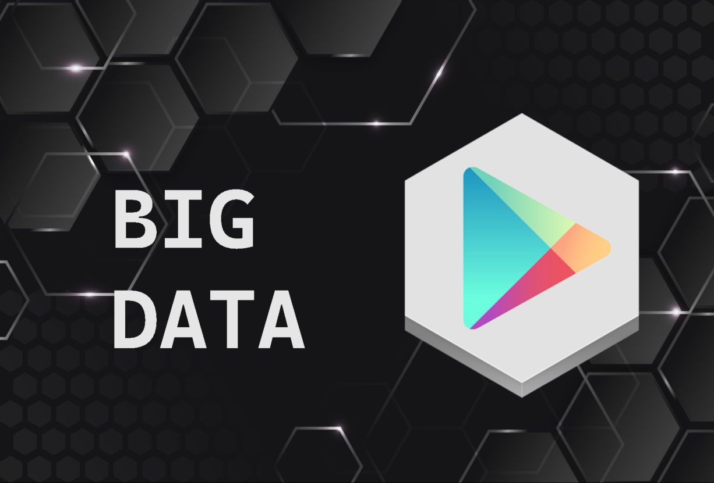

<h1 align="center"> BigData - Google Play Store </h1>

This project was developed as a BigData challenge by Xpand IT company.

  <a href="#technologies">Technologies</a>&nbsp;&nbsp;&nbsp; |&nbsp;&nbsp;&nbsp;
  <a href="#project">Project</a>&nbsp;&nbsp;&nbsp; |&nbsp;&nbsp;&nbsp;
  <a href="#memo-license">License</a>

  

 

  

# Technologies

This project was developed with the following technologies:

- Scala
- Spark
- Maven
- Git
- GitHub

# Project

This project presents a series of challenges designed to take files with information from the Google Play Store and clean the data to generate rating metrics.
 
You can check some results data by click [HERE](.github/results) or access the output files [HERE](src/main/resources).

# :memo: License

This project is under the MIT License.

---

Developed by [Tiago Cebola](https://github.com/TiagoCebola). :wave:
